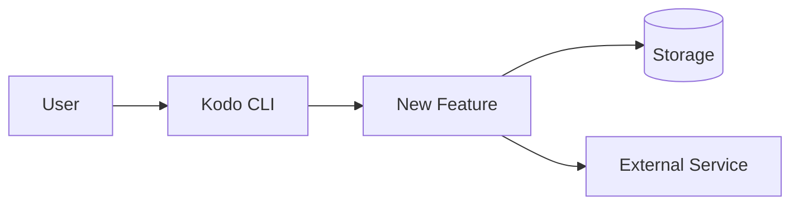
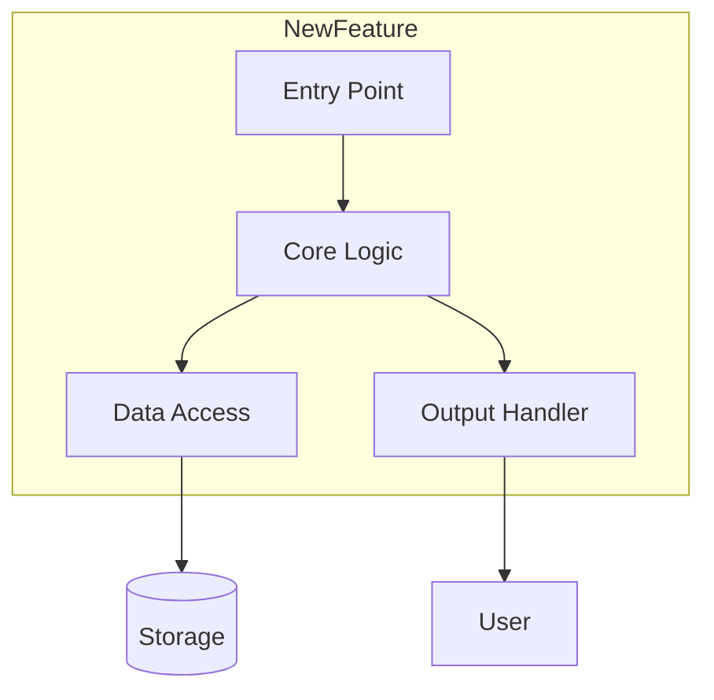
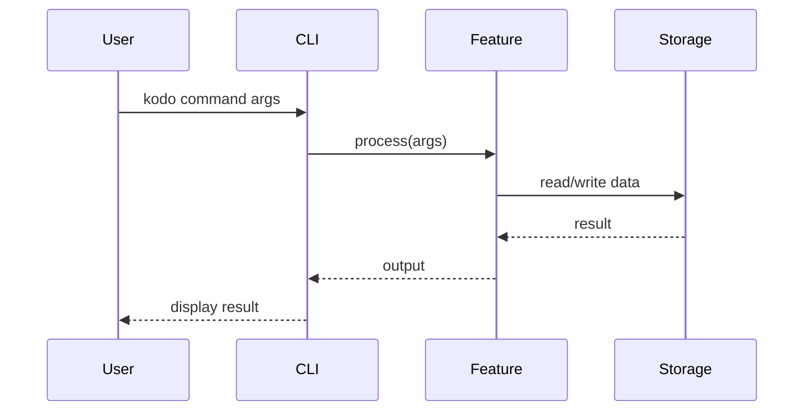

# Design Document Template

Template for documenting designs after brainstorming sessions.

---

## Document Location

Save design documents to: `docs/plans/YYYY-MM-DD-<feature-name>-design.md`

---

## Template

```markdown
---
title: [Feature Name] Design
status: draft | review | approved
created: YYYY-MM-DD
updated: YYYY-MM-DD
author: [Name]
reviewers: []
github_issue: "#123"
---

# [Feature Name] Design

## Problem Statement

### What problem are we solving?

[2-3 sentences describing the user problem or need. Focus on the "why" not the "what".]

### Who is affected?

[Describe the users/systems that need this. Be specific.]

### What happens without this?

[Describe the current pain point or workaround.]

---

## Proposed Solution

### High-Level Approach

[2-3 sentences summarizing the solution. Should be understandable by someone unfamiliar with the codebase.]

### Key Design Decisions

| Decision | Chosen Option | Alternatives Considered | Rationale |
|----------|---------------|------------------------|-----------|
| [Decision 1] | [Choice] | [Other options] | [Why this choice] |
| [Decision 2] | [Choice] | [Other options] | [Why this choice] |

---

## Architecture

### System Context

[Where this fits in the overall system. Show external dependencies.]



### Component Diagram

[Internal structure of the new feature.]



---

## Component Breakdown

### Component 1: [Name]

**Purpose:** [One sentence describing what this component does]

**Responsibilities:**
- [Responsibility 1]
- [Responsibility 2]
- [Responsibility 3]

**Interface:**
```rust
pub struct ComponentName {
    // Key fields
}

impl ComponentName {
    pub fn new(config: Config) -> Result<Self, Error>;
    pub fn primary_method(&self, input: Input) -> Result<Output, Error>;
}
```

**Dependencies:**
- [Dependency 1]: [Why needed]
- [Dependency 2]: [Why needed]

### Component 2: [Name]

[Same structure as above]

---

## Data Flow

### Primary Flow



### Data Structures

```rust
/// Primary input structure
#[derive(Debug, Clone)]
pub struct FeatureInput {
    /// Description of field
    pub field1: String,
    /// Description of field
    pub field2: Option<i32>,
}

/// Primary output structure
#[derive(Debug, Clone)]
pub struct FeatureOutput {
    /// Description of field
    pub result: String,
    /// Description of field
    pub metadata: HashMap<String, Value>,
}
```

---

## Error Handling

### Error Categories

| Error Type | When It Occurs | User Message | Recovery |
|------------|----------------|--------------|----------|
| [ErrorType1] | [Condition] | [Message] | [Action] |
| [ErrorType2] | [Condition] | [Message] | [Action] |

### Error Hierarchy

```rust
#[derive(Debug, thiserror::Error)]
pub enum FeatureError {
    #[error("Configuration error: {0}")]
    Config(String),

    #[error("IO error: {0}")]
    Io(#[from] std::io::Error),

    #[error("Validation failed: {0}")]
    Validation(String),
}
```

---

## Testing Strategy

### Unit Tests

| Component | Test Focus | Coverage Target |
|-----------|------------|-----------------|
| [Component1] | [What to test] | [%] |
| [Component2] | [What to test] | [%] |

### Integration Tests

| Scenario | Components Involved | Setup Required |
|----------|---------------------|----------------|
| [Scenario1] | [Components] | [Setup] |
| [Scenario2] | [Components] | [Setup] |

### Test Fixtures

```rust
/// Test fixture for [scenario]
fn create_test_fixture() -> TestFixture {
    TestFixture {
        // ...
    }
}
```

---

## Open Questions

- [ ] [Question 1 that needs resolution]
- [ ] [Question 2 that needs resolution]

---

## Future Considerations

**Out of scope for now, but may be needed later:**

- [Future enhancement 1]
- [Future enhancement 2]

---

## Appendix

### Glossary

| Term | Definition |
|------|------------|
| [Term1] | [Definition] |
| [Term2] | [Definition] |

### References

- [Link to related documentation]
- [Link to external resources]
```

---

## Section Guidelines

### Problem Statement

**Do:**
- Focus on the user's perspective
- Be specific about the pain point
- Quantify impact if possible

**Don't:**
- Jump to solutions
- Use technical jargon
- Be vague ("improve performance")

### Architecture Diagrams

**Use Mermaid for:**
- System context (external view)
- Component relationships (internal view)
- Sequence diagrams (data flow)
- State machines (state transitions)

**Mermaid quick reference:**
```mermaid
%% Flowchart
flowchart TD
    A[Start] --> B{Decision}
    B -->|Yes| C[Action]
    B -->|No| D[Other]

%% Sequence
sequenceDiagram
    A->>B: Request
    B-->>A: Response

%% State
stateDiagram-v2
    [*] --> State1
    State1 --> State2: trigger
    State2 --> [*]
```

### Component Breakdown

For each component, answer:
1. What single thing does it do?
2. What does it depend on?
3. What depends on it?
4. What's the public interface?

### Error Handling

Document:
- All error conditions
- User-facing messages
- Recovery actions
- Error propagation

### Testing Strategy

Cover:
- What needs testing most
- What fixtures are needed
- What mocking is required
- Integration test scenarios

---

## Kodo Integration

**After saving design:**
```bash
git add docs/plans/<design-file>.md
git commit -m "docs: add <feature> design document"

kodo reflect --signal "Design decision: <key choice>"
kodo track link #123  # Link to GitHub issue
```

**Handoff to implementation:**
```
Ready to create implementation plan with kodo:plan skill?
```
